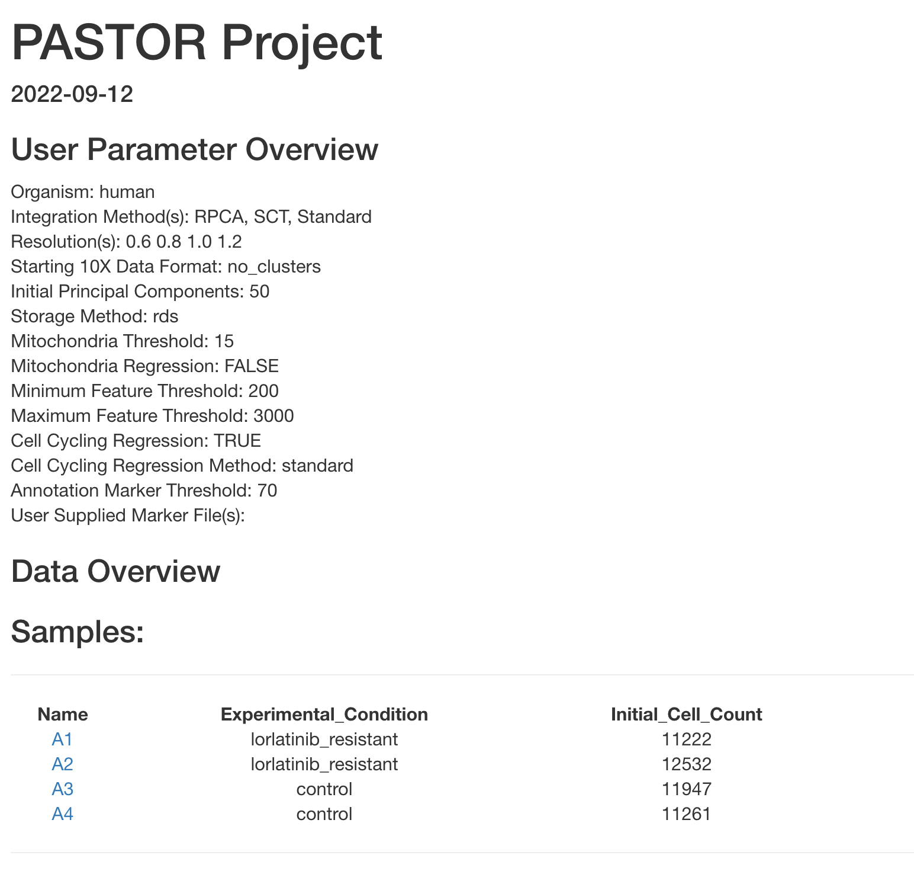
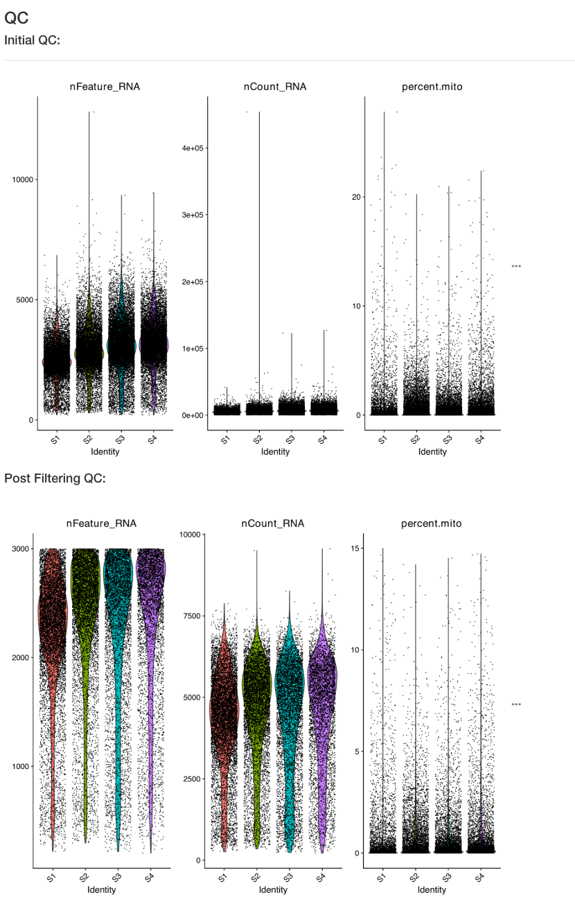
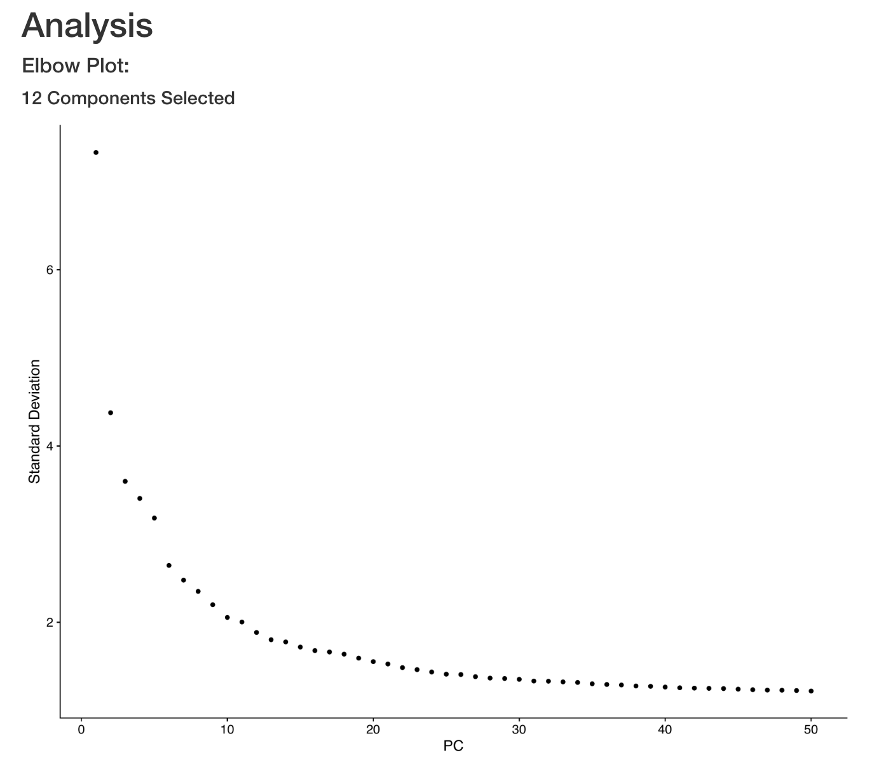
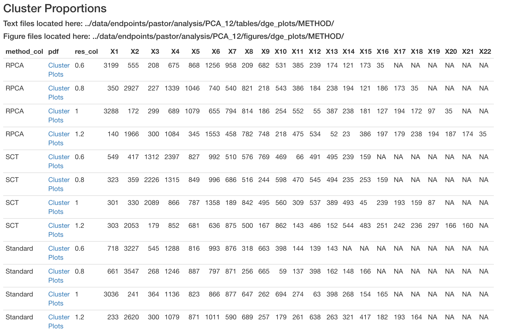
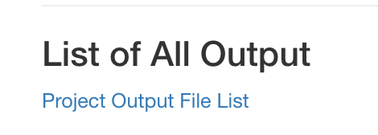
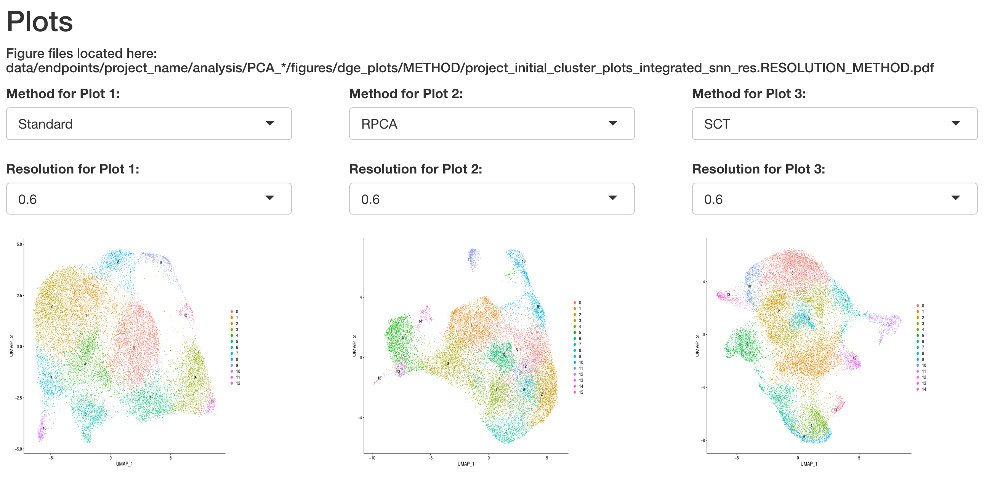
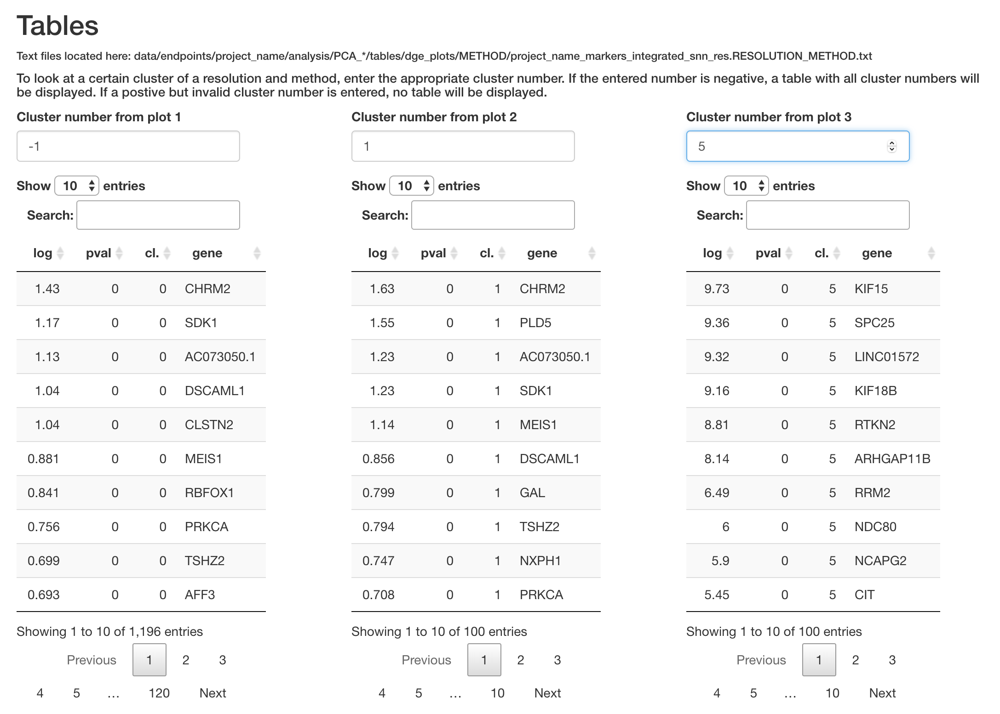

# scRNA_pipelines_Targets Report
* *******************************************************************************

Below is an overview of the HTML/interactive Report. For this example, the zealous PI wanted to look at all 3 integration methods along with 4 different resolutions! In this case, there are 12 different clustering arrangements (only 3 schemas can be viewed at once)! 

Clicking on the `Project Output File List` link (in index.html file, not here) would take you to an html file that contains links to all output files. For this vignette, the file does not contain hyperlinks. 
[pastor_tree](pastor_tree)

